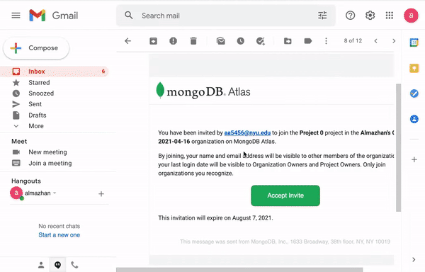

# Interactive Data Portal for Humanities Research Lab Summer 2021

### Project Description

The IDP is a flexible, real-time data visualization tool for historical research. The IDP was built for internal use at NYU Shanghai.

### Team Members

- [Sarah Tahir](https://github.com/saraaahh63)
- [Alma Kapan](https://github.com/almazhankapan)
- [Tim Wu](https://github.com/TimWGY)
- [Kai Elwood-Dieu](https://github.com/KaiElwood)
- [Olivia Lin](https://github.com/oliviafroglin)
- [Pamela Pan](https://github.com/pamela-pan)
- [Winny Wang](https://github.com/winnyww)
- [Yufeng Zhao](https://github.com/yz3440)

### Minimum Viable Product

The user will be able to query the database and vizualize selected data through six chart types: histogram, bar chart, boxplot, scatter pot, matrix, and line graph. The user will be able to save their session history and selected graphs to their profile for future use.

### Contributing and More

If you would like to contribute to this project, please take a look at the [CONTRIBUTING.md](./CONTRIBUTING.md) file and follow the instructions there.

### Building and Testing

To build the project, please install the following software: <br>

- Install [Git](https://git-scm.com/) to follow the git workflow specified for team members and external contributors.
- Install [Node.js](https://nodejs.org/) to contribute to and test the code.
- Install [Visual Studio Code](https://code.visualstudio.com/download) and recommended linter to standardize the formatting of the code. <br>
  To contribute to the project, please refer to the 'Rules for contributors' and 'Git workflow for team members' sections in the [CONTRIBUTING.md](./CONTRIBUTING.md) file.

### Run the project

To run the project, ensure all of the software above is installed. Then, complete the following steps:

Clone the repository. You can clone the repo using VS Code interface or type in the terminal the following command:<br>

```
git clone (Repository link)
```

After, change your current directory to the project repository by running: <br>

```
- cd (directory name)
```

Within the project folder, change the directory to front-end by doing the following command: <br>

```
- cd front-end
```

Before starting the react-app run the following npm commands in the ./front-end path: <br>

```
- npm install
```

To start the react-app: <br>

```
- npm start
```

- Before starting the back-end server, navigate within the project folder in a different terminal and change the directory to back-end by doing the following command: <br>

```
- cd back-end
```

Before starting the back-end server run the following commands in the ./back-end path: <br>

```
- npm install
```

To start the server: <br>

```
- npm start
```

### Contribute to the project

Follow the steps outlined in the [contributing guide for developers](https://github.com/HRL-at-NYUSH/Interactive-Portal/blob/main/CONTRIBUTING.md#the-git-workflow-that-the-team-follows)

### Dependencies

### MongoDB Connection Setup

All members of the Interactive Portal were invited to access the MongoDb Atlas Database Cluster for Humanities Research Lab.
To set up your account, please complete the following steps:

1. Accept invite in your email to access the HRL MongoDb Cluster
2. Sign up to MongoDb if you haven't yet (use your google nyu email).
3. Go to the **Database Access** tab and click on **Add a new database user** and register a new user - select a username and password and remember them for the future use. View the gif with instructions below.<br>
   

### MongoDB Data Upload

1. Convert data from csv to json using the open source projects as [this one](https://csvjson.com/csv2json). The mock data which is currently uploaded to the database is available in csv format [here](https://docs.google.com/spreadsheets/d/1KWH-BrgNkeRjoB60bMJh1dfcQ_HHSIWIOPR8jO6rRCg/edit#gid=1479728107) and json format [here](front-end/src/js/utils/raw).
2. Install MongoDB server (Community version) following the instructions [here](https://docs.mongodb.com/manual/installation/).
3. To check if the MongoDB server is installed, please type the following command in the terminal:

```
mongo --version
```

You should see a version information. Otherwise, please try to reinstall MongoDB server. 4. In the MongoDB Atlas, go to the Cluster 0 and click on the primary cluster. In the newly opened tab, copy the name of the primary cluster, for example, _cluster0-shard-00-02.cc5yp.mongodb.net:27017_ 5. Now go to the terminal and import your json file to the HRL Cluster. Please type the following command in the terminal:

```
mongoimport --host cluster_name --db new_database --type json --file ./myfile.json --jsonArray --authenticationDatabase admin --ssl --username your_username --password your_password
```

- **cluster_name** is the name of the primary cluster that you retrieved in step 4. For example, _cluster0-shard-00-02.cc5yp.mongodb.net:27017_
- **new_database** is the name of the database where you would like to upload your data. You can view existing databases by clicking on your cluster (Cluster 0 for this project).
- **./myfile.json** is the path to the json file that you would like to upload to the database.
- **your_username** is your MongoDB username for the working cluster (from step 3 in the _MongoDB Connection Setup_ section above).
- **your_password** is your MongoDB password for the working cluster (from step 3 in the _MongoDB Connection Setup_ section above).

6. To view the newly uploaded data, in the MongoDB Atlas, go to your Cluster (Cluster 0) and click on _Collections_ - here you will be able to see the datasets.

### Postman Setup

To set up a postman application
https://web.postman.co/home

Postman is a desktop app that allows you to trigger custom HTTP requests to your local development web server, which relieves you from having to write (and debug) front-end code while your focus is on perfecting the back-end.

Once installed, get started by clicking the Create a request link on the Launchpad screen. Enter a route you have set up in express, such as http://localhost:3000/, and click the Send button.

It is possible to tweak request settings to simulate any kind of request a front-end could make.

It is possible to save requests you want to run frequently so you can quickly test them as you work on the code.

You can find a file called [express-js-starter-app.postman_collection.json](/back-end/utils/express-js-starter-app.postman_collection.json) that can be imported into Postman to easily try out all these routes.

The list of routes that you can try are in the back-end folder. For a more detailed explanation on the routes, please see the tutorial below.
