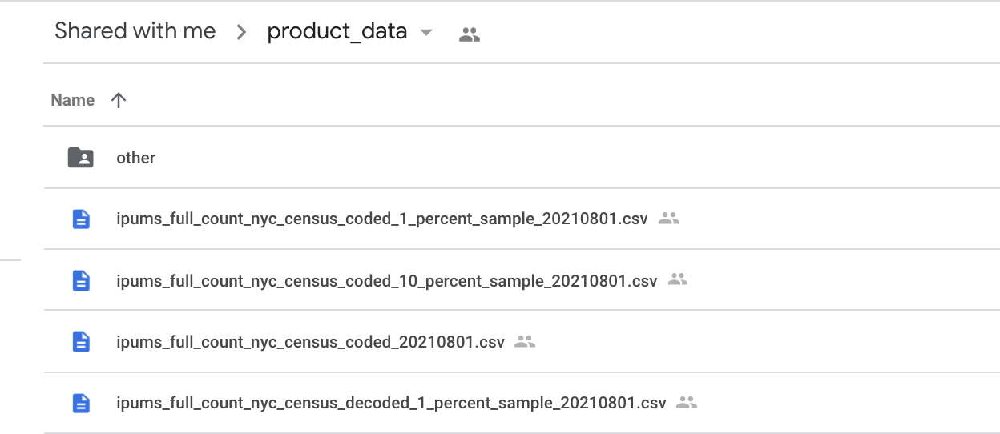
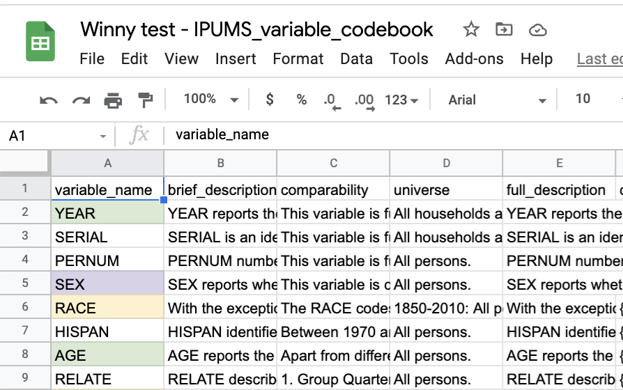
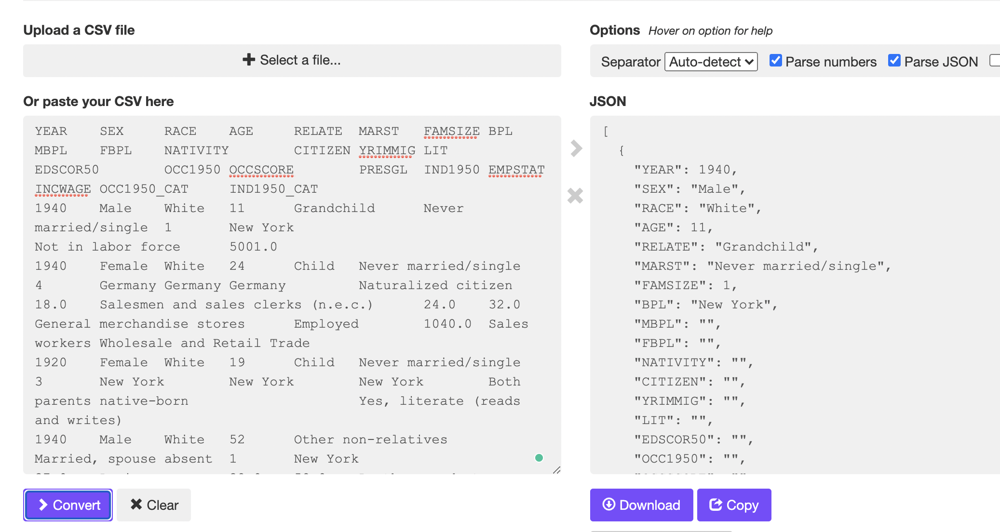

# Front-end notes

## Week 1

Welcome to the HRL Interactive Portal team! You are contributing to a high impact project with potentially hundreds of users from NYU Shanghai community and beyond! This will look great on your CV ^-^ Good luck!

View git workflow recorded tutorial, install React and complete the exercise. For troubleshooting, reach out to Alma or Sarah.

## Week 2

### Mock JS data

Mock JS data is uploaded in the [utils](https://docs.google.com/forms/d/e/1FAIpQLScHZWErUzf4Va2pIp-jfaT0APpLI42g3VxjmACjSkuPjB2OMQ/viewform?usp=sf_link) folder - you can start playing with the data!
There are two files: MockNonGeo.js and MockGeo.js. <br/>
MockNonGeo.js contains data without geospatial information (no latitude, longitude info) and MockGeo.js contains geospatial information.

To view a sample React file that includes components and imports the data, take a look at the SampleDataUse.js file and visit the SampleDataUse route (you can find it on the [menu panel](https://github.com/HRL-at-NYUSH/Interactive-Portal/blob/main/front-end/images/menu.png) of the React app). On the SampleDataUse page, you should see the an example of using geospatial and nongeospatial mock data (using the same component):


Firstly, to import the data, include the following lines in your javascript file:

const { dataNonGeo } = require('../utils/MockNonGeo.js')

const { dataGeo } = require('../utils/MockGeo.js')

Then, you can call/modify the data inside your component. One particular use of the mock data is provided in the DataDisplay component - selected key-value pairs (from MockGeo.js and MockNonGeo.js files) are displayed using the map function.

## Week 3

### Tailwind CSS

Tailwind CSS is a CSS framework made up of [**utility classes**](https://tailwindcss.com/docs/utility-first), which is more lower-level than frameworks like Bootstrap. Let's take a look at an example:


To build custmized component, we no longer need to specify the styles in a separate css file, but instead declare them in the **classes** of HTML elements.

In the example above, the class `p-6` means `padding: 1.5rem;`, `text-gray-500` means `color: rgba(107, 114, 128, var(--tw-text-opacity));`, and all the other definitions can be found in the [documentation page](https://tailwindcss.com/docs).

#### Code with Tailwind CSS easily

There are extensions/plugins for text editors to help you code Tailwind CSS more easily. If you are using VSCode, [Tailwind CSS IntelliSense](https://marketplace.visualstudio.com/items?itemName=bradlc.vscode-tailwindcss) is a great extension that provides **autocompletion** and **hover preview**.


#### Other Notes

[Responsive Design with Tailwind CSS](https://tailwindcss.com/docs/responsive-design) is straightforward. You can add prefix to Tailwind classes to specify different screen size. Tailwind CSS is **mobile first** in that de unprefixed classes will be applied to the screen sizes **smaller** than the **smallest** specified prefix. For example:

```html
<!-- Width of 16 by default, 32 on medium screens, and 48 on large screens -->

```

[Heroicons](https://heroicons.com/) is an icon pack made by the Tailwind CSS team. To use it in the react project, see the example here:

To load this icon:


The code looks like this:

```javascript
import { QuestionMarkCircleIcon } from '@heroicons/react/solid';
export default function () {
  return (
    <QuestionMarkCircleIcon className='w-8 h-8 fill-current text-green-500 group-hover:text-green-600'></QuestionMarkCircleIcon>
  );
}
```
## Week 4

### Get started with real data

#### Look a look first

If the Mock JS Data doesn't seem to be enough, or you simply want to see how your graph might look in application, it is a good idea to get started with the real data and further develop your design 👻

Prior to joining the team, all of you already had access to the [product data](https://drive.google.com/drive/u/0/folders/1SWSNZYz0JwZycDfM1-fB48ic513riQrU) folder. Inside, you can find **csv** files of nyc census data. Take a look at the files and see if you can figure out what is the difference between `coded` and `decoded` data.



To better understand the big data in front of you, open [variable codebook](https://drive.google.com/drive/u/0/folders/1SWSNZYz0JwZycDfM1-fB48ic513riQrU) file. The codebook walks you through each variables in the datasheet. If you want to make notes, **make a copy** of the codebook and **name** it for yourself. 

For example, I made a copy and color coded the `numerical` and `categorical` variable for further use. 



***

#### import (part of) the real data

Firstly, the real data is _huge_. A simple way to just give the real data a try is to convert part of the **csv** data to **json**. You can easily do that with online converter. I use [this](https://csvjson.com/) online converter to convert 2000 datapoints into json. 



Then, create a new file in  `front-end/src/utils/`, e.g.  `../utils/MockData-Winny.js`. Refer to `MockData.js` to structure your test data as below. 

```javascript
const data = [...
];

export { data };
```

Don't forget to import it in `GraphDisplay.js` file, and done!

```javascript
import { data } from '../utils/MockData-Winny.js';
```


## Resources

The following articles might be helpful:

- [Create React App documentation](https://facebook.github.io/create-react-app/docs/getting-started).
- [React official documentation](https://reactjs.org/).
- [React Components I](https://www.robinwieruch.de/react-function-component)
- [React Functional Components from geeksforgeeks](https://www.geeksforgeeks.org/reactjs-functional-components/)
- [How to use React components](https://www.infoworld.com/article/3603276/how-to-use-react-functional-components.html)

Let team leaders know if you have any questions! If you have React/Express/JS/setup related questions, reach out to Alma, if you have graphs/visualization/D3/JS related questions, reach out to Sarah and if you have data visualization and data cleaning, python related questions, reach out to Tim ^-^
